# HOLO Diagram

<p align="center">
  <a href="https://github.com/LeanderLXZ/holo-diagram/releases"></a>
  
  <a href="LICENSE"></a>
</p>

**Draw polished, minimalist flowcharts in Claude Code — just describe the
flow, get a clean diagram.** No design skills required, no diagramming tool to
learn. You describe a pipeline or process in plain language (or paste a Mermaid
spec); the skill renders it onto a locked visual language and hands you a
standalone file — SVG by default, or PNG / HTML — that drops straight into a
README, slide, or doc.

- 🗣️ **Describe in plain language** — "draw our checkout pipeline…" is enough.
- 🎨 **Three themes** — `light`, `dark`, `mono-print`.
- 🔒 **Consistent every time** — a fixed palette, shapes, arrows, and spacing,
  so regenerating a diagram doesn't make it drift.
- 📦 **Self-contained output** — the SVG embeds its own styles + web font; it
  opens in any browser and renders identically wherever you paste it.

> Already using the **[HOLO](https://github.com/LeanderLXZ/holo)** plugin?
> It bundles the same capability as its [/draw-flowchart](https://github.com/LeanderLXZ/holo/blob/main/skills/draw-flowchart/SKILL.md) skill — **holo-diagram** is the standalone edition.

<p align="center">
  <a href="#quick-start">Quick Start</a> ·
  <a href="#output--export">Output &amp; Export</a> ·
  <a href="#example-prompts">Example Prompts</a> ·
  <a href="#examples">Examples</a> ·
  <a href="#themes">Themes</a> ·
  <a href="#color-palette">Color Palette</a> ·
  <a href="#installation">Installation</a>
</p>

---

## Quick Start

### 1. Install the Plugin

In Claude Code:

```
/plugin marketplace add https://github.com/LeanderLXZ/holo-diagram.git
/plugin install holo-diagram
```

### 2. Describe What You Want to Draw

Type a description in your own words, paste a Mermaid / prose spec, or ask
Claude to draft one for you. The more concrete the nodes and connections, the
better:

```
A flowchart of our checkout pipeline:
cart → validate input → charge card.
On success, write to the orders table; on failure, show an error.
There's also a retry loop back to "charge card".
```

### 3. Run the Skill

```
/holo-diagram Draw the checkout pipeline above. Dark theme, output SVG.
```

Claude will:

1. **Confirm format & width** — the output format (SVG / PNG / HTML / all
   three) and canvas width (auto-fit, or a fixed width).
2. **Restate the spec** back to you and map each node to a role.
3. **Generate, self-review, and fix** — three internal reviewers check the
   first render; the corrected version is your deliverable.

The finished files land in **`./tmp_diagram/`** in your current project.

---

## Output & Export

You pick the format when Claude confirms it (or state it up front in your
prompt). All artifacts are written to **`./tmp_diagram/`** in your current
project.

| Format | What you get | Use it for |
|---|---|---|
| **SVG** *(default)* | A standalone `.svg` — embeds CSS + web font | READMEs, docs, slides; lossless scaling |
| **PNG** | A rasterized image | Chat / docs that don't accept SVG |
| **HTML** | The editable source (CSS in `<head>`, inline SVG) | Hand-tweaking before re-exporting |
| **all three** | `.svg` + `.png` + `.html` | When you want every form |

Embed the SVG / PNG in a doc with the width Claude suggests:

```html

```

Want it kept permanently? Copy it out of `./tmp_diagram/` into your repo (e.g. `assets/diagrams/`).

---

## Example Prompts

Invoke the skill with `/holo-diagram`, then describe the flow. Name the
**theme** (`light` / `dark` / `mono-print`) and the **output format** (`SVG` /
`PNG` / `HTML` / `all three`) so Claude doesn't have to ask.

**Simple pipeline**
```
/holo-diagram Draw a flowchart: ingest → clean → transform → load into the
warehouse. Light theme, output SVG.
```

**Agentic loop**
```
/holo-diagram Draw an agentic loop: gather context → call tool → verify
results, looping back to "gather context" until done. Add a "user can cancel"
callout. Dark theme, output PNG.
```

**Branching / decision**
```
/holo-diagram Flowchart: receive request → "authenticated?" decision.
If yes → handle request → return 200. If no → return 401.
mono-print theme, output SVG.
```

**From a Mermaid spec**
```
/holo-diagram Render this Mermaid graph as a flowchart. Dark theme, output all three format:
graph TD
  A[Start] --> B{valid?}
  B -->|yes| C[Process]
  B -->|no| D[Reject]
  C --> E[Done]
```

---

## Examples

Real diagrams generated by the skill. The same flow rendered in different
themes stays geometrically identical — only the palette swaps.

<p align="center">
  <br>
  <em>the planning pipeline of the <strong><a href="https://github.com/LeanderLXZ/holo">HOLO</a></strong> plugin — <strong>dark</strong></em>
</p>

<p align="center">
  <br>
  <em>the implementation pipeline of the <strong><a href="https://github.com/LeanderLXZ/holo">HOLO</a></strong> plugin — <strong>light</strong></em>
</p>

<p align="center">
  <br>
  <em>the review pipeline of the <strong><a href="https://github.com/LeanderLXZ/holo">HOLO</a></strong> plugin — <strong>mono-print</strong></em>
</p>

**Content cards** — a node whose height grows to hold a bold title, detail
lines, and an optional port line (great for service / component descriptions):

<p align="center">
  
</p>

The full set — every flow in all three themes, plus fan-in/out, bridge
crossings, and more — lives in [`examples/`](examples/) and
[`skills/holo-diagram/examples/`](skills/holo-diagram/examples/).

---

## Themes

Three render-verified themes share **identical geometry** — only the color
values change. Name the one you want in your prompt (`light` is the default).

<p align="center">
  <br>
  <strong>dark</strong> —  for dark-mode UI / terminal screenshots
</p>

<p align="center">
  <br>
  <strong>light</strong> — for docs / blogs / light-mode UI
</p>

<p align="center">
  <br>
  <strong>mono-print</strong> — for print / academic / no-color
</p>

---

## Color Palette

The visual language is fixed: a small set of **node roles**, a set of
**group-box tints** for bracketing regions, and a set of **line / arrow
styles**. Each is defined for all three themes. The reference plates below are
the canonical source of truth (the editable HTML lives in
[`skills/holo-diagram/palette/`](skills/holo-diagram/palette/)).

### Node Roles

Every box is one of **8 roles** (plus 2 spare `accent` slots). Most steps are
just `action`; reach for another role only when it adds real meaning, so the
diagram doesn't fragment into a rainbow. Name a role in your prompt if you want
a specific node colored a specific way.

<p align="center">
  
</p>

| Role | What it is | Examples |
|---|---|---|
| **action** | Process step / command — the verb | "Validate input", "Transform" |
| **agent** | External actor / user / service | "User", "Payment API", "LLM" |
| **data** | Persisted store — file / DB / queue | "users table", "S3 bucket" |
| **decision** | Branch / gate / conditional | "if valid?", "quota left?" |
| **event** | Trigger / signal / webhook | "order placed", "cron tick" |
| **state** | Outcome / status marker | "Approved", "Failed" |
| **terminal** | Entry / exit point | "Start", "Done" |
| **callout** | Out-of-band note / interrupt | "User can cancel" |
| **accent1 / accent2** | spare slots — no fixed meaning | use when the 8 aren't enough |

### Group-Box Tints

A dashed rounded rectangle that brackets a *subset* of nodes forming one phase
/ region (e.g. "agentic loop"). The tint is a neutral grouping signal — never a
node role. Use one tint for a single region, distinct tints to tell several
regions apart. `mono` uses a plain grey container instead of tints.

<p align="center">
  
</p>

### Lines & Arrows

Four edge styles. Forward flow and loop-back are thick (5px) solid lines;
conditional / optional and callout edges are thin (3px) dashed. Arrowheads are
a fixed size whose apex lands exactly on the destination edge.

<p align="center">
  
</p>

---

## Installation

### From GitHub (Recommended)

```
/plugin marketplace add https://github.com/LeanderLXZ/holo-diagram.git
/plugin install holo-diagram
```

### From a Local Clone

```bash
git clone https://github.com/LeanderLXZ/holo-diagram.git
```

Then in Claude Code:

```
/plugin marketplace add /path/to/holo-diagram
/plugin install holo-diagram
```

### Updating

```
/plugin marketplace update holo-diagram
/reload-plugins
```

### Requirements

- **Claude Code** with plugin support.
- **Python 3** (standard library only) — converts the HTML source to a
  standalone SVG.
- **Chrome / Chromium headless** (`google-chrome` on your `PATH`) — rasterizes
  a PNG so the internal review step can visually inspect the diagram. Without
  it you can still get SVG/HTML output; only the automated review pass is
  skipped.

---

## Technical Details

- **Self-contained output** — the SVG is the canonical deliverable. The CSS and
  the `Inter` web-font import travel *inside* the file, so it opens in any
  browser and renders identically wherever you paste it, with no external
  dependencies. The HTML is an editable source you can hand-tweak and
  re-export; the PNG is a raster export (also used internally for the review
  step). All artifacts land in **`./tmp_diagram/`**.
- **Sizing** — the viewBox defaults to a 1500px canvas (hard cap); the display
  width is capped at 825px so it fits a GitHub README column; padding is 50px
  on every side. A set of diagrams shares one width so their text scale matches.
- **Locked visual language** — rounded-rectangle nodes (`rx=12`), uniform 18px
  labels, fully orthogonal arrows with rounded `r=12` corners, fixed
  `refX=0` / `userSpaceOnUse` arrowheads whose apex lands exactly on the
  destination edge.
- **Pipeline** — Claude writes an editable HTML intermediate, extracts the
  standalone SVG with
  [`scripts/extract_svg.py`](skills/holo-diagram/scripts/extract_svg.py),
  and renders a throwaway PNG only for the review subagents. A diagram passes
  through at most **two iterations** (draw → review → fix).
- **Scope** — flowcharts, pipelines, process diagrams, agentic loops, workflow
  visualizations, state machines. *Not* for architecture / network topology,
  UML, Gantt, or org charts.
- **Full spec** — the complete, mandatory specification is in
  [`skills/holo-diagram/SKILL.md`](skills/holo-diagram/SKILL.md).

---

## License

[MIT](LICENSE) © LeanderLXZ
